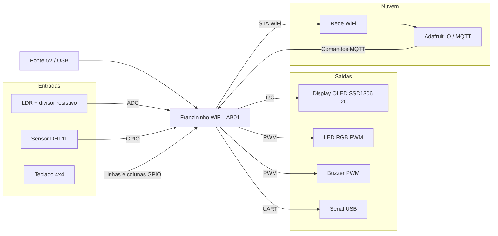

# Diagrama de Blocos do Hardware

## Leituras e comandos

- LDR envia luminosidade para o ADC.
- DHT11 envia temperatura e umidade por um pino digital.
- O teclado permite configurar limites e desligar o buzzer.
- O OLED mostra conectividade, leituras, alarmes e limites.
- O Adafruit IO recebe os dados e devolve os comandos do LED RGB.
